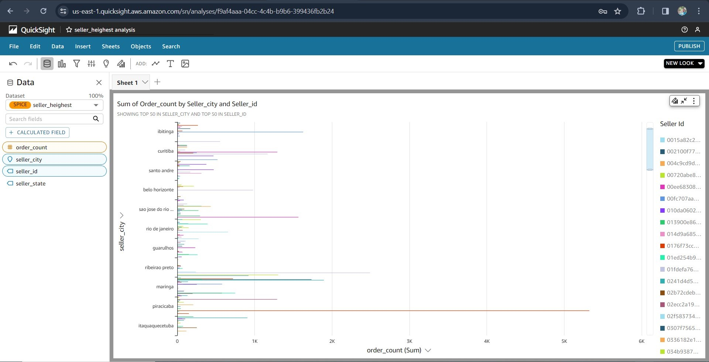
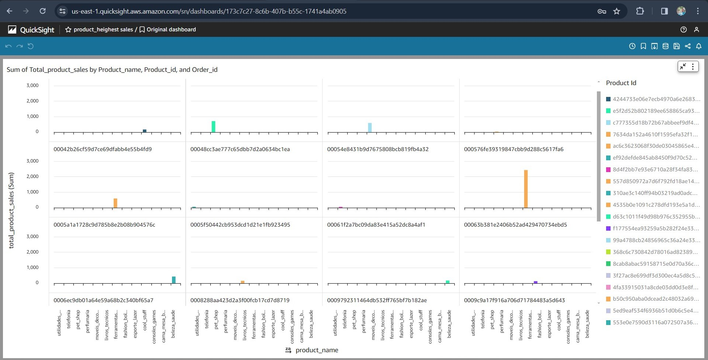

# Ecommarce kaggle Dataset data warehousing pipline cdk
This pipline is an end to end data Redshift warehousing project with ecommarce dataset from kaggle
the data is load to s3 raw zone bucket and then send sns notification to trigger lambda function to trigger glue job perform etl and load the data to consumption zone the use anthena and redshift to query the data. all the query scripts can be found in the project folder. for redshit query is located in the redshift folder and also anthena also sample dataset can be found on it folder too

## Pipline workflow
1. created table for all the dataset
2. create views and materialized for product with heigest sale and sellers with heighest orders


## Architechure Diagram


## Dataset schema design 


## Sample ecommarce Data on S3 data lake


## Redshift  cluster warehouse table creation


## Seller with the Highest Sales order Sample Query


## Product with Highest Sales


## QuickSight seller with dashboard


## QuickSight product with dashboard


```
$ python -m venv .venv
```

After the init process completes and the virtualenv is created, you can use the following
step to activate your virtualenv.

```
$ source .venv/bin/activate
```

If you are a Windows platform, you would activate the virtualenv like this:

```
% .venv\Scripts\activate.bat
```

Once the virtualenv is activated, you can install the required dependencies.

```
$ pip install -r requirements.txt
```

At this point you can now synthesize the CloudFormation template for this code.

```
$ cdk synth
```

